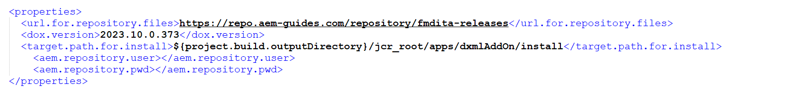

# **Steps for adding AEM Guides Solution**

Follow this step-by-step guide to customise AEM Guides using your existing code repository.

## [Optional] Overriding Guides OSGI Configurations

This is an optional configuration, which is required only if you have existing OSGi configurations that you want to retain. In case you do not have any OSGi configurations to override, then you have an option of deleting the dox/dox.config.override folder.

For more details on configuring OSGi, see [OSGi Configuration in the Repository](https://experienceleague.adobe.com/docs/experience-manager-65/deploying/configuring/configuring-osgi.html) in AEM&#39;s documentation

- Add your OSGI properties overrides in the below files
  - src/main/content/jcr\_root/apps/fmditaCustom/config/com.adobe.fmdita.config.ConfigManager.xml
  - src/main/content/jcr\_root/apps/fmditaCustom/config/com.adobe.fmdita.xmleditor.config.XmlEditorConfig.xml
- You can also add more properties with the relevant PID to override other AEM Guides solution specific OSGI properties
- Commit the changes and run the Cloud Manager pipeline to deploy configuration changes.

## [Optional] Enable Edit in Oxygen feature

You can enable the Edit in Oxygen feature by adding the package details in the pom.xml file. In case you do not want to enable this feature, then you have an option of deleting the dox/dox.openinoxygen.installer folder.

- Add dox.openinoxygen.installer module in /dox/pom.xml
- Add AEM Maven repository credentials for the open-in-oxygen package. These are shared in the welcome email.

## Adding Guides module

> [!NOTE]  
> Starting AEM Guides release 2024.2.0, this process has now been deprecated. For the correct process to install AEM Guides on AEM Cloud Service please refer this [link](https://experienceleague.adobe.com/docs/experience-manager-guides/using/release-info/release-notes/cloud-release-notes/deploy-xml-on-aemaacs.html?lang=en)

- Create a clone of your Cloud Manager&#39;s Git repository.
- Copy the "DoX" folder from this repository to root directory of the cloud manager code.
- Update  **/dox/pom.xml**

- Replace the parent pom section with your parent&#39;s pom details, as shown below:

- Update the artifact Id as per your application&#39;s naming convention:

- Update  **/dox/dox.installer/pom.xml**

  - Update the artifact id as per your application&#39;s naming conventions.
  - Add AEM Maven repository credentials for the AEM Guides solution package. These are shared in the welcome email.

- Add the AEM Guides solution module in the parent pom module section.

